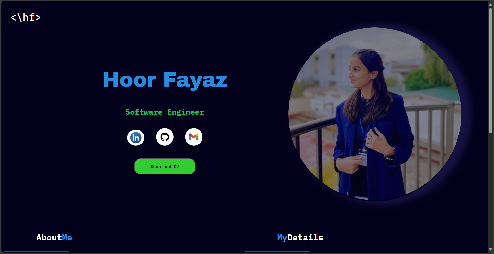

# Portfolio - Hoor Fayaz

A personal portfolio website built with HTML and CSS.  
Showcases profile, skills, contact information, and downloadable CV.

## Features

- Responsive layout
- Animated elements and hover effects
- Downloadable CV button
- Social and contact links

## Getting Started

1. Clone or download this repository.
2. Open `index.html` in your browser.

## Screenshot

  

## File Structure

- `index.html` – Main webpage
- `style.css` – Stylesheet
- `c9c6fef4-2398-4502-b62c-6e25dd638b83.jfif` – Profile image
- `hello.jpg` – (Optional image)